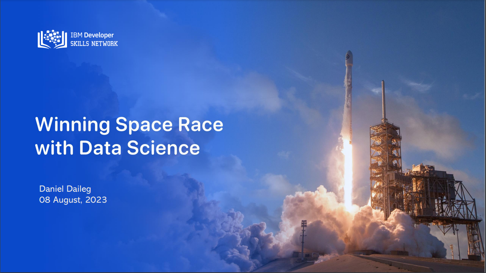

## Portfolio
---
### Projects

[Neural 20 Questions: Multi-Agent Entropy-Based AI](https://github.com/DDaileg/neural-20-questions)

A multi-agent AI that identifies unknown concepts through entropy-optimal yes/no questioning. Uses a hybrid reasoning layer: hard boolean filtering via a structured attribute table, semantic re-ranking via spaCy cosine similarity (300-dim vectors), and ConceptNet-driven question selection for knowledge-graph arbitration. Architecture: BeliefAgent, QuestionAgent, GuesserAgent, and GameRunner. Reasoning trace exposed per turn: entropy score, candidate count, question source.

*Phase 3: Streamlit demo in progress.*

---

[IBM Data Science Capstone: Winning Space Race with Data Science](https://ddaileg.github.io/IBM-Data-Science-Capstone-Project/)

End-to-end data science project analyzing SpaceX launch data to predict first-stage rocket landing success. Covers data collection (REST API + web scraping), EDA, SQL analysis, interactive Folium/Plotly Dash visualizations, and a tuned classification model.

---

[IBM Data Science Capstone Findings Report](pdf/Capstone Findings Report.pdf)

Formal findings report from the SpaceX capstone project. Documents methodology, key insights, and model performance recommendations for a fictional competitor looking to underbid SpaceX launches.

---

Page template forked from <a href="https://github.com/evanca/quick-portfolio">evanca</a>

<!-- Remove above link if you don't want to attibute -->
