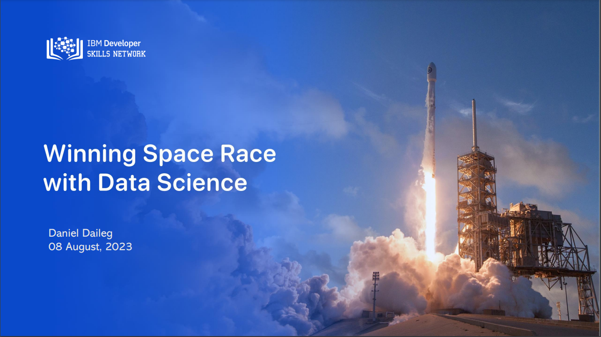
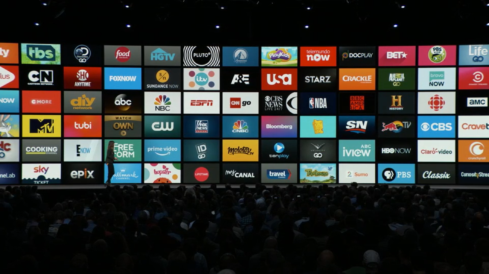

## Portfolio

---

### Projects 

[IBM Data Science Capstone: Winning Space Race with Data Science](https://ddaileg.github.io/IBM-Data-Science-Capstone-Project/)

---
[IBM Data Science Capstone Findings Report](pdf/Capstone Findings Report.pdf)

---
<!--[Coursera Data Science Coding Challenge:Churn Prediction](https://www.coursera.org/workspaces/authenticate/sharedopcmjzlp?path=%2Fnotebooks%2FChurnPrediction.ipynb&forceRefresh=false&isLabVersioning=file-prep)-->
<!---->

Page template forked from <a href="https://github.com/evanca/quick-portfolio">evanca</a>

<!-- Remove above link if you don't want to attibute -->
